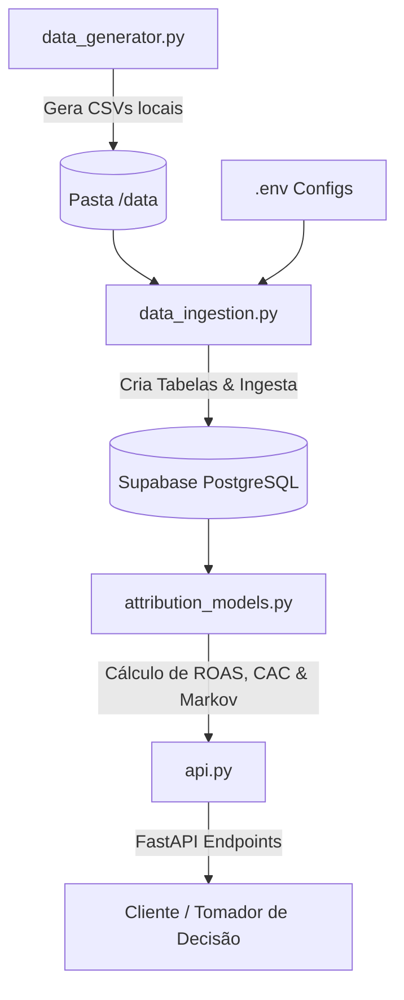

# Marketing Traffic & Attribution Pipeline (MTA-Pipeline)

Este repositório contém um pipeline de engenharia e ciência de dados completo (End-to-End) projetado para resolver um dos problemas mais críticos e desafiadores do marketing moderno: a **Atribuição Multicanal (Multi-Touch Attribution - MTA)**.

O objetivo do projeto é consolidar dados de fontes distintas (tráfego de cliques dos usuários e gastos diários em anúncios), modelar essas informações em um banco de dados estruturado PostgreSQL na nuvem (Supabase) e aplicar modelos estatísticos e matemáticos (incluindo **Cadeias de Markov**) para determinar o impacto real de cada canal de aquisição sobre as vendas, expondo esses resultados e recomendações via API.

---

## 1. O Problema de Negócio

No cenário digital moderno, a jornada de compra de um usuário raramente é linear ou envolve um único ponto de contato. Um cliente pode:
1. Ver um anúncio de descoberta no **TikTok Ads** e clicar nele.
2. Dias depois, pesquisar sobre o produto e acessar o site via **Google Ads**.
3. Receber um e-mail de remarketing e clicar no link do **Email**.
4. Finalmente, fechar a compra digitando diretamente o site no navegador (**Organic**).

Se a empresa utilizar o modelo clássico de **Last Touch (Último Clique)** para medir seu marketing, 100% da receita será atribuída ao canal *Email*, ignorando que o *TikTok Ads* e o *Google Ads* participaram ativamente do processo de atração. Isso gera decisões incorretas, como cortar a verba do TikTok Ads (achando que ele não converte), fazendo a receita geral despencar a médio prazo.

**Este projeto resolve essa dor ao:**
- Rastrear a jornada completa de múltiplos cliques de cada usuário.
- Computar modelos tradicionais (First Touch, Last Touch, Linear).
- Implementar um modelo baseado em **Cadeia de Markov**, que remove vieses de regras arbitrárias e atribui valor de conversão com base em probabilidades de transição e no **Efeito de Remoção (Removal Effect)** de cada canal.
- Expor relatórios de custo de aquisição (CAC), retorno de publicidade (ROAS) e recomendações automatizadas de otimização de verba.

---

## 2. Arquitetura da Solução

O pipeline é estruturado localmente e integrado com a nuvem, seguindo boas práticas de engenharia de software de forma modularizada:



- **Insumos de Dados (`src/data_generator.py`)**: Script que simula dados realistas de mercado, incluindo a criação de logs de cliques de usuários que convertem (jornadas de 1 a 4 cliques) e de usuários que não convertem (crucial para treinar a Cadeia de Markov corretamente), além de gastos diários flutuantes por canal de publicidade.
- **Data Warehouse (`src/database.py` & `src/data_ingestion.py`)**: Camada que mapeia esquemas via SQLAlchemy, cria fisicamente as tabelas e realiza a ingestão e limpeza (bulk insert) no banco de dados PostgreSQL hospedado na nuvem pelo **Supabase**.
- **Motor Científico (`src/attribution_models.py`)**: Módulo que extrai os dados relacionais de cliques e vendas, reconstrói os caminhos navegacionais, modela a Cadeia de Markov de forma pura em numpy/pandas para encontrar o efeito de remoção e calcula as métricas financeiras (**CAC** e **ROAS**).
- **Consumo (API FastAPI - `src/api.py`)**: Expõe os relatórios de performance de marketing e recomendações de distribuição orçamentária sob demanda.

---

## 3. Metodologia e Stack de Tecnologias

- **Linguagem**: Python 3.12+
- **Processamento e Estruturação de Dados**: `pandas`, `numpy`
- **Banco de Dados Relacional**: PostgreSQL (hospedado no **Supabase**)
- **ORM & Conexão SQL**: `SQLAlchemy`, `psycopg2-binary`
- **Serviço de API**: `FastAPI`, `uvicorn`
- **Gerenciamento de Variáveis**: `python-dotenv`
- **Matemática do Modelo**: Cadeias de Markov Absorventes calculadas via álgebra linear matricial:
  
  $$B = F \times R$$
  onde $F = (I - Q)^{-1}$ é a Matriz Fundamental que descreve o número esperado de passos nos estados temporários antes da absorção (conversão ou não-conversão).

---

## 4. Como Reproduzir o Projeto (Setup)

Siga os passos abaixo para configurar e executar o projeto na sua máquina:

### Passo 1: Clonar o Repositório e Configurar Ambiente
Navegue até a pasta do projeto e instale as dependências listadas:
```bash
# Criar ambiente virtual
python -m venv venv
# Ativar ambiente virtual (Windows)
.\venv\Scripts\activate

# Instalar dependências
pip install -r requirements.txt
```

### Passo 2: Configurar o Banco de Dados no Supabase
1. Crie uma conta gratuita no [Supabase](https://supabase.com/).
2. Crie um novo projeto no painel.
3. Vá em **Project Settings** -> **Database** -> **Connection String** e copie a URI na aba **URI** (conexão direta).
4. No diretório raiz do projeto, crie um arquivo chamado `.env` (copie o modelo do `.env.example`) e preencha a sua Connection String:
   ```env
   SUPABASE_DB_URL=postgresql://postgres.[seu-usuario]:[sua-senha]@[seu-host]:5432/postgres
   ```

### Passo 3: Ingerir os Dados Iniciais
Execute o script gerador para criar a simulação de cliques e vendas, e em seguida rode o script de ingestão para criar a estrutura e carregar os dados no Supabase:
```bash
# 1. Gerar dados sintéticos locais
python src/data_generator.py

# 2. Executar pipeline de criação de tabelas e carregamento no banco
python src/data_ingestion.py
```

### Passo 4: Executar a API FastAPI
Inicie o servidor de desenvolvimento para disponibilizar a API:
```bash
python src/api.py
```
A API estará disponível no endereço: [http://localhost:8000](http://localhost:8000). A documentação Swagger interativa pode ser acessada em [http://localhost:8000/docs](http://localhost:8000/docs).

---

## 5. Principais Insights e Otimizações de Orçamento

Ao consumir os relatórios pelos endpoints da API, é possível extrair as seguintes tomadas de decisão estratégicas:

1. **Minimizar Vieses de Canal**: O modelo de **Markov** atribui valor distribuído com base no impacto incremental da presença do canal no mix. Por exemplo, se o *TikTok Ads* tiver um alto Efeito de Remoção porque ele sempre atua abrindo novas jornadas, o modelo de Markov valorizará o investimento nele, diferentemente do modelo *Last Touch*, que o classificaria incorretamente como prejuízo (ROAS < 1.0).
2. **Recomendação Dinâmica de Budget (`/optimize`)**: A API calcula a média de ROAS dos canais pagos. Canais que possuem ROAS 20% superior à média geram sugestões imediatas de **acréscimo de orçamento**, enquanto canais ineficientes geram recomendações de **redução de gastos**, otimizando a saúde do CAC geral da companhia.
